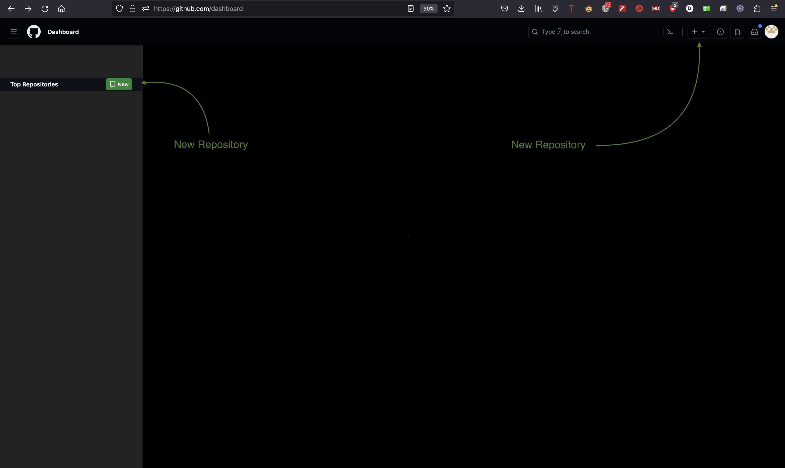
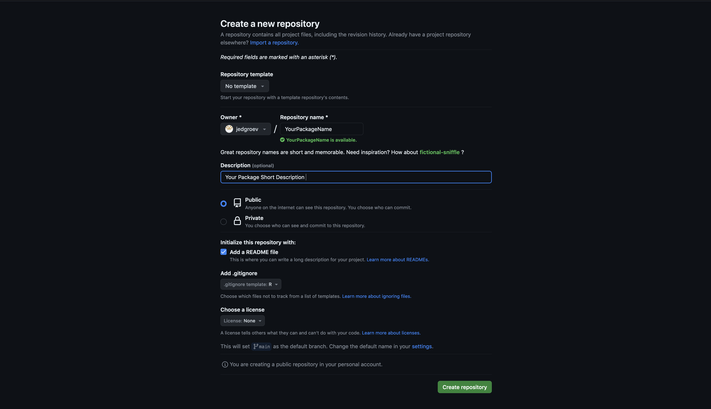
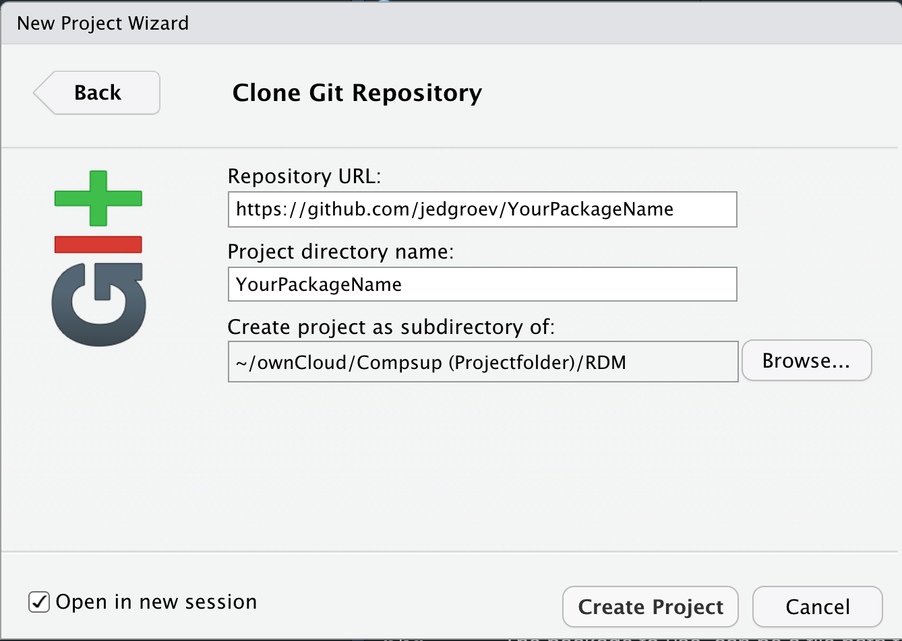

<!-- README.md is generated from README.Rmd. Please edit that file -->

```{r, include = FALSE}
knitr::opts_chunk$set(
  collapse = TRUE,
  comment = "#>",
  fig.path = "man/figures/README-",
  out.width = "100%"
)
```

<!-- ## Table of Contents -->

<!-- [Introduction](#introduction) </br> -->
<!-- [Before starting](#beforestarting) </br> -->
<!-- 1. [Creating a basic R package](#basicpackage) </br> -->
<!-- 2. [Roxygen: Document R package ](#documentroxygen) </br> -->
<!-- 3. [Data](#data) </br> -->
<!-- 4. [Vignettes](#vignettes) </br> -->
<!-- 5. [Build](#build) </br> -->
<!-- 6. [GIT](#GIT) </br> -->
<!-- 7. [Build a website](#www) </br> -->
<!-- 8. [Large File Support](#LFS) </br> -->
<!-- 9. [Shortcuts](#shortcuts) -->

<!-- OVERVIEW  -->
<!-- 1. Create package repository structure  -->
<!-- 2. Create and dfunctions in ./R/functions.R -->
<!-- 3. Document Add Roxygen tags to function  -->
<!-- 4. Document  -->
<!-- 5. Load package  -->

<!-- # <a name="introduction"></a> -->

# Introduction 

R packages give you a structure to organize your code (and data) in a structured and standardized manner. In essence, an R package is a hyper-organized R-project of functions. A first tip, whether you want to create an R package or not, it is always a good idea to organize analyses that are part of a single work-package (e.g. publication, presentation) into an R-project (and to use functions for tasks that can be repeated). A prerequisite to facilitate creating an R package is basic knowledge of rstudio-GUI. While R-studio is not necessary to create an R package, it really makes it much easier. 

<!-- # <a name="beforestarting"></a> -->

Before digging into the subject here is an short overview of the rstudio GUI and a list of necessary packages that will help you with building your first R package. 

## Rstudio panels

* **editor**
* **console**, terminal, R markdown, jobs
* **files**, plots, packages, help, viewer
* **environment**, history, connections, **build**, **git**, tutorial

 

To learn more in detail about project management with R studio and rmarkdown please have a look at the following pressuse resources:

* https://carpentries-incubator.github.io/Reproducible-Publications-with-RStudio/
* https://swcarpentry.github.io/r-novice-gapminder/

## Packages 

Install the following two quintessential packages that will make your life much easier.

```r
install.packages('devtools')
install.packages('usethis')
install.packages('pkgdown')
```


<!-- # <a name="rstudiopackages"></a> -->

# Creating a basic R package 

In this section, we'll guide you through the process of creating a basic R package using the `devtools` package.

## Create the package repository structure 

To initiate your R package, start by creating the necessary directory structure. 

In the RStudio menu, navigate to `File -> New Project -> New Directory -> R package -> name` and replace "name" with the desired name for your package.

```r
devtools::create("~/SCCRpackage")
#usethis::create_package('~/SCCRpackage')
```

## Adding functions 

Once your package structure is set up, you can add functions to it. Open an R script in the `R/` directory and include your desired functions. Here, we've added two temperature conversion functions as examples:

```r
F_to_C <- function(F_temp){
    C_temp <- (F_temp - 32) * 5/9;
    return(C_temp);
}

C_to_F <- function(C_temp){
    F_temp <- (C_temp * 9/5) + 32;
    return(F_temp);
}
```

## Load R package

To test your functions within the package, load it into your R environment using one of the following methods:

* Execute `devtools::load_all()` in the R console.
* Use the shortcut <kbd>command</kbd> + <kbd>tab</kbd> + <kbd>L</kbd>.
* Navigate to `Build -> Load All` in the RStudio menu.

```r
devtools::load_all() 
```


## Exercise

---

    Create a minimum viable R package manually including:

    1) Package Directory (SCC_R_package)
    2) R-directory (SCC_R_package/R)
    3) Functions (SCC_R_package/R/functions.R)
    4) Description-file (SCC_R_package/DESCRIPTION)
    
    Then, load package with load_all(), try functions and check documentation (e.g., ?F_to_C)

---


In the upcoming sections, we'll delve into further details on documentation, testing, and package building. This initial setup lays the foundation for developing a well-organized and functional R package.

<!-- # <a name="documentroxygen"></a> -->

# Document with Roxygen

Roxygen is a system for documenting R code within the source code itself, and it uses special tags to provide metadata about functions and other elements of the code. 

**Table 1.** Roxygen Tags Overview ordered by importance and relevance

|  tag         |   description                                                                                      |
|:----------------------------------------|:---------------------------------------------------------------------------------------|
| @title       | Provides a short, one-line description of the purpose of the documented object.         |
| @description | Offers a more detailed description of the documented object. This tag is important for providing comprehensive information about the function or object. | 
| @param | Documents function parameters. Each parameter is typically documented using a separate @param tag, providing details such as the parameter name, type, and description.         | 
| @return       | Describes the return value of a function. Similar to @param, it includes details like the type of the return value and a description. |
| @examples    | Provides examples of how to use the function or code block. Examples are crucial for users to understand how to apply the code in practical situations. | 
| @author      | Specifies the author(s) of the code. It's a good practice to give credit to those who contributed to the code. | 
| @seealso     | Links to other related functions or documentation. This tag helps users find additional relevant information. |
| @details     | Offers additional details or information that might be important for users to understand the inner workings or special considerations related to the documented object. | 
| @import      | Indicates the packages that need to be imported for the code to run successfully. This is important for users to know which dependencies are required.
| @source      | Specifies the source of the code. This can be useful for giving credit or referencing the origin of the code. | 
| @references  | Provides references or citations related to the code. This is especially important for academic or research-oriented code. | 
| @export        | Indicates that a particular function or object should be exported when the package is loaded. This is essential for package development. | 
| @keywords      | Specifies keywords related to the code. This can aid in searching and categorizing the code. | 
| @inheritParams | Indicates that the documented function inherits parameters from another function. This can be useful when functions share similar parameter sets. | 

These tags are commonly used in Roxygen documentation, but the importance of each tag may vary depending on the specific context and use case. It's generally recommended to include the essential tags such as @title, @description, @param, and @return, and then add additional tags based on the needs of the documentation.

In most cases adding @examples to the documentation of your R package functions is recommended. Including illustrative examples not only improves the usability of your package but also aids users in understanding how to effectively implement your functions in their own workflows. Moreover, it also helps you to remember the functionality of your function. 

## Navigate to functions.R

Navigate to the following directory `./R/functions.R` within the R package you just created.

## Document your functions 

Document these functions by adding roxygen tags (@param, @return, @examples, @export, @details, @description, @name) to each function.

To quickly add the roxygen skeleton, put the pointer within a function and then:

* Use the shortcut <kbd>option</kbd> + <kbd>tab</kbd> + <kbd>command</kbd> + <kbd>R</kbd>.
* Navigate to `Code -> Insert Roxygen Skeleton` in the RStudio menu.

```r
#' @Title C_to_F
#'
#' @param C_temp 
#'
#' @return 
#'
#' @export
#'
#' @examples
#' # Convert Celcius to Farenheit
#' F <- C_to_F(20)
#'
#' # Convert Celcius to Farenheit, but avoid running it for tests
#' \dontrun {
#' F <- C_to_F(20)
#' }
#' 
#'
C_to_F <- function(C_temp){
    F_temp <- (C_temp * 9/5) + 32;
    return(F_temp);
}
```

--- 

**NOTE**

The `\dontrun` tag is useful when an example should not be automatically executed. This can be necessary for examples that may have side effects, such as downloading large datasets or creating time-consuming computations. How to Use not run: simply include `\dontrun{}` in the example you want to exclude from automatic execution.

---

## Document package 

The function `document()` will automatically create the function documentation. Use load all to load your package locally

```r
devtools::document()
devtools::load_all()
```

If you inspect the function F_to_C you will see that documentation is now available. 

```r
?C_to_F
```

------

## Exercise

    We have now documented the function C_to_F by adding the roxygen tags. 
    Use the same approach to document the F_to_C function.     

------

<!-- # <a name="data"></a> -->

# Add Data

Adding data to your package enhances its functionality and ensures that users have access to essential datasets. The `use_data()` and `use_data_raw()` functions simplify the workflow of saving package data in the correct format. Follow these steps to include datasets in your package:

## Create data-raw directory

The `use_data_raw()` function sets up a directory named `data-raw` and includes a template R-script, `DATASET.R`.

```r
usethis::use_data_raw() 
```

## Navigate to DATASET.R

Go to the `data-raw` directory and open the script `DATASET.R`.

## Edit DATASET.R 

Edit `DATASET.R` to load and format the dataset, saving it as a suitable .rda file using the `usethis::use_data()` function.

```r
# example of a created dataset 
date <- as.Date('2023-09-01')
timestamp <- seq(date,date + 30,1)
celcius <- sample(seq(10,20,0.1),length(timestamp))
temperatures <- data.frame(timestamp=timestamp,celcius=celcius)

# create a data directory and store the rda file with use_data()
usethis::use_data(temperatures, overwrite = TRUE)
```

## Document your dataset 

In the `R/` directory, document your dataset using Roxygen tags. Include essential information such as @name, @description, @format, @source, and variable details. Good practice is to create an R script named `data` in which you document your datasets. 

```r
# example 
#' name Prices of 50,000 round cut diamonds.
#'
#' A dataset containing the prices and other attributes of almost 54,000
#' diamonds.
#'
#' @format A data frame with 53940 rows and 10 variables:
#' \describe{
#'   \item{price}{price, in US dollars}
#'   \item{carat}{weight of the diamond, in carats}
#' }
#' @source \url{http://www.diamondse.info/}
diamonds 
```


------

## Exercise

    Document above created `temperatures` data frame using the Roxygen-tags: 
    @name, @description, @format and @source. 
    
    Make sure to describe each column of the data frame. 

------

<!-- # <a name="vignettes"></a> -->

# Add Vignettes 

It is a good idea to add extra detailed documentation of the usage of the R package as vignettes. Vignettes are in essence R markdown files with a specific header. To extend your R package with vignettes use the function below. 

```r
usethis::use_vignette("test") 
```

<!-- # <a name="build"></a> -->

# Build 

Once your package is ready, you can build your package using `devtools::build()` which will create a tarball (a compressed archive) of your package in the `./pkg/` directory. 

Before building, it's a good idea to check your package for common issues using `devtools::check()`. The latter function performs a series of checks to ensure that your package meets certain standards and is ready for distribution. These checks help ensure the overall quality, consistency, and compliance of your R package with best practices and standards. It's recommended to address any issues reported during the `devtools::check()` process before submitting your package to CRAN or sharing it with others.

Here are some of the key checks that `devtools::check()` performs:

|  check         |   description                                                                                      |
|:----------------------------------------|:----------------------------------------------------------------------------------------------------|
|   R CMD check| This is a comprehensive set of checks performed by the R CMD check command. It includes various sub-checks for code syntax, documentation, and package structure. It ensures that your package adheres to the standards set by the R community. | 
|R CMD build|  Checks are made to ensure that your package can be successfully built into a tarball (compressed archive). |
|R CMD INSTALL|  Installs your package locally to check for installation issues. |
|Package dependencies|  Checks that the dependencies declared in the DESCRIPTION file are available and can be installed. |
|CRAN checks|  Checks specific to CRAN (Comprehensive R Archive Network) submission requirements. These include checks for package licensing, proper use of URLs, and other guidelines specified by CRAN. |
|Namespace checks|  Verifies that your package namespace is properly defined and does not have any conflicts. |
|Code style and best practices|  Checks for adherence to coding style conventions, as recommended by the R community.|
|Documentation checks|  Verifies that the documentation is correctly formatted and that all exported functions are documented. |
|Examples checks|  Runs examples provided in the documentation to ensure they work as intended. |
|Vignette checks|  If your package includes vignettes, it checks that they can be built without errors. |
|Unit tests|  If you have unit tests in your package, they are executed to ensure that your functions work as expected. | 
|License checks|  Verifies that your package has a valid license specified in the DESCRIPTION file. | 
|Encoding checks| Checks that your source code files use a consistent and valid character encoding. | 

## Check Your Package

Check makes a list of checks to test the validity of your package. Use one of the following approaches to run the checks: 

* Execute `devtools::check()` in the R console.
* Use the shortcut <kbd>tab</kbd> + <kbd>command</kbd> + <kbd>E</kbd>.
* Navigate to `Build -> Check Package` in the RStudio menu.
* Navigate to the `Build` tab and click `Check` in upper-right panel

```r
devtools::check()
```

Address any issues that arise during the checking process.

## Build Your Package

Once your package is ready, you can build your package. Use one of the following approaches: 

* Execute `devtools::build()` in the R console.
* Execute `R CMD build YourPackageName` from the directory in which your package is stored, and `YourPackageName` is the R Package directory name.
* Use the shortcut <kbd>command</kbd> + <kbd>shift</kbd> + <kbd>B</kbd> or <kbd>ctrl</kbd> + <kbd>shift</kbd> + <kbd>B</kbd> 
* Navigate to `Build -> Build Package` in the RStudio menu.

```r
devtools::build()
```

This will create a tarball (a compressed archive) of your package in the ./pkg/ directory.

## Install and Load Your Package

You can install your package locally for testing using:

```r
install.packages("path/to/YourPackageName_x.y.z.tar.gz", repos = NULL, type = "source")
```

Replace "path/to/YourPackageName_x.y.z.tar.gz" with the actual path to your package tarball.

## Buildignore

To ignore including certain files or directories modify the buildignore file. This will exclude specific directories when building your package. For instance, you might want to ignore the raw-data directory, since you will not need it for the functioning of your R package. 

```r
usethis::use_build_ignore(c("yourfolder1", "yourfolder2", "yourfile"))
```

## Exercise

---

    1. Adjust the buildignore file and add the raw-data directory
    2. Exclude any other directory that is not necessary 
    3. perform checks and correct issues
    4. build package and search for the zipped file
    5. install package 

---
<!-- # <a name="GIT"></a> -->


# GIT

This tutorial provides a step-by-step guide on how to set up a new project on GitHub or GitLab, link it to your RStudio, and use basic Git commands for version control.

## Create a New Project on GitHub/GitLab

    Navigate to the GitHub or GitLab website.
    Create a new project and choose a name (YourPackageName).
    Decide whether you want the repository to be public or private.
    Include a README file during the initialization process.
    Provide optionally already a license and description

 
 

## Copy the Repository Link

    Copy the HTTP link of your repository. 
    For example, https://github.com/<YourAccount>/<YourPackageName>.git.

 


## Set Up the Project in RStudio

    Open RStudio and choose File -> New Project -> Version Control -> Git.
    Paste the Repository URL and specify the Project directory name (e.g., `YourPackageName`) 

 

## Make Changes and Commit

    Open the `README` file in RStudio.
    Make a change (e.g., add a new line).
    Use the Git pane in RStudio to commit the changes.
          Stage the changes.
          Add a meaningful commit message.
          Click `Commit`

## Push Changes to Git

    Push the committed changes to the GitHub or GitLab repository. 
    Use the `Push` button in the Git pane.

---

Important Git Commands:

    Commit: Use commit to submit changes to Git.
    Push: Use push to push the committed changes to Git.
    Pull: Use pull to fetch changes made in GitHub or GitLab.

Tips and Tricks:

    Commit changes with meaningful descriptions to provide context.
    Regularly pull changes to keep your local copy updated.
    Utilize branches for feature development or bug fixing.


Gitignore:

    Don't forget to create a .gitignore file to specify files and directories that Git should ignore.

---

<!-- # <a name="www"></a> -->

# Building a website 

In this tutorial, you'll learn how to create a YAML configuration file (_pkgdown.yml) for your R package using usethis::use_pkgdown(). We'll also cover the importance of YAML files and the steps to build and view your package website.

## Create YAML Configuration

Run the following command to create the _pkgdown.yml file:

```r
usethis::use_pkgdown()
```

This command creates a basic YAML configuration file in your package directory.

## Edit the _pkgdown.yml File

Open the generated _pkgdown.yml file and customize it according to your preferences. This file contains settings for your package website, including the destination, URL, and navigation bar.

Example _pkgdown.yml:

```yml
destination: public
url: https://<USERNAME>.gitlab.io/<REPOSITORYNAME>/
development:
  mode: auto

navbar:
  right:
    - icon: fa-gitlab
      href: https://gitlab.com/<USERNAME>/<REPOSITORYNAME>
```

Adjust the destination and url fields with your GitLab or github username and repository name.

## Build Your Package Website

Ensure your package has a DESCRIPTION file and a README file. If not, run:

```
usethis::use_description() 
usethis::use_readme_rmd()
```

Then, generate your package website using:

```r
pkgdown::build_site()
```

This command creates a `docs/` directory containing HTML files for your website.

2.2 Commit Changes to Git

Before building the website, commit the changes to your Git repository:

```r
usethis::use_git()
usethis::use_git_commit(message = "Add pkgdown configuration and setup")
```

Alternatively, commit using the approach as described in the GIT section.

## Activate Pages on GitHub and GitLab

### GitHub Pages Activation

    Go to your GitHub repository.
    Navigate to the "Settings" tab.
    Scroll down to the "GitHub Pages" section.
    Set the "Source" branch to main or master (whichever branch you are using).
    Confirm the activation.

### GitLab Pages Activation

The activation process for GitLab Pages can vary based on your GitLab instance and permissions. Typically, it involves:

    Go to your GitLab repository.
    Navigate to the "Settings" or "CI / CD" section.
    Look for "Pages" settings.
    Configure the Pages settings, including the source branch.

Please refer to the specific documentation of your GitLab instance for detailed instructions.

## View Your Package Website

After building the site, your package website will be available at the following link:

```php
https://<USERNAME>.github.io/<REPOSITORYNAME>/
```
Replace <USERNAME> and <REPOSITORYNAME> with your GitHub username and repository name.

<!-- # <a name="LFS"></a> -->

# Large File Support

Large file support comes in handy if you would like to include large files in your package without versioning. This means that every time a LFS-object is changed, a new version is uploaded without tracking previous changes. To allow LFS navigate to (https://git-lfs.com/)[https://git-lfs.com/] to download and install the git LFS extension. 

## Set up LFS 

Once downloaded and installed, set up Git LFS for your user account by running:

```
git lfs install
```

You only need to run this once per user account.

## Select file types 

In each Git repository where you want to use Git LFS, select the file types you'd like Git LFS to manage (or directly edit your .gitattributes). You can configure additional file extensions at anytime.

```
git lfs track "*.html"
```

## Check .gitattributes 

Now make sure .gitattributes is tracked:

```
git add .gitattributes
```

<!-- # <a name="shortcuts"></a> -->

# Shortcuts

|  MacOS / Windows                                                           | R command    | Rstudio Menu |  
|:-------------------------------------------------------------------------|:------------------------------------------------------------------|:----------|
| <kbd>command</kbd> + <kbd>shift</kbd> + <kbd>E</kbd> <br/> <kbd>ctrl</kbd> + <kbd>shift</kbd> + <kbd>E</kbd> | devtools::check() | build -> Check Package | 
| <kbd>command</kbd> + <kbd>shift</kbd> + <kbd>B</kbd> <br/> <kbd>ctrl</kbd> + <kbd>shift</kbd> + <kbd>B</kbd> | devtools::build() | build -> Build Source Package | 
| <kbd>command</kbd> + <kbd>shift</kbd> + <kbd>L</kbd> <br/> <kbd>ctrl</kbd> + <kbd>shift</kbd> + <kbd>L</kbd> | devtools::load_all() | build -> load all | 
| <kbd>ctrl</kbd> + <kbd>option</kbd> + <kbd>M</kbd> <br/> <kbd>ctrl</kbd> + <kbd>alt</kbd> + <kbd>M</kbd> | | Tools -> Version Control -> Commit | 
| <kbd>command</kbd> + <kbd>shift</kbd> + <kbd>C</kbd> <br/> <kbd>ctrl</kbd> + <kbd>shift</kbd> + <kbd>C</kbd> |  | Code -> Comment/Uncomment Lines | 
| <kbd>option</kbd> + <kbd>shift</kbd> + <kbd>command</kbd> + <kbd>R</kbd> <br/> <kbd>ctrl</kbd> + <kbd>alt</kbd> + <kbd>shift</kbd> + <kbd>R</kbd> |  | Code -> Insert Roxygen Skeleton |

# EXTRA 

## todor

```r
install.packages('todor')
```


